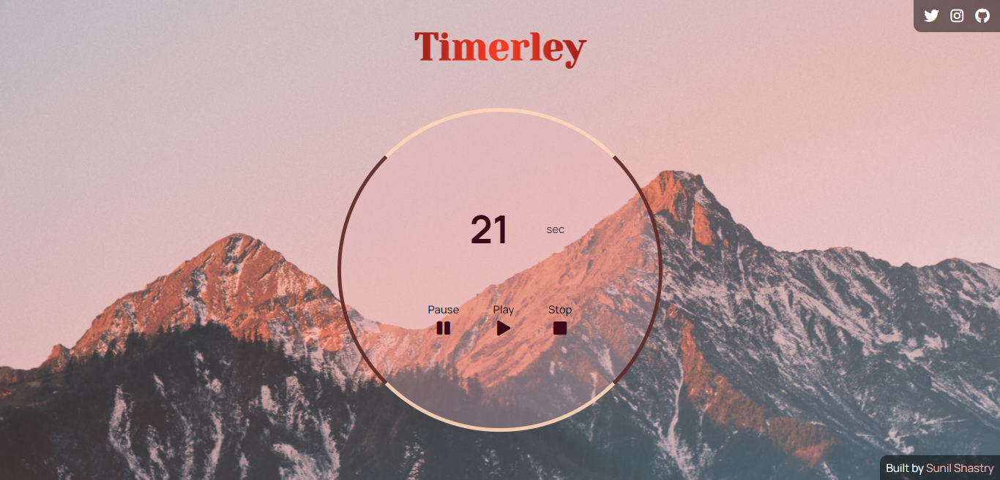

# Timerley

## By [Sunil Shastry](https://www.sunilshastry.com/ "Sunil Shastry").

---

_**Timerley** is a specialized type of clock that helps for measuring specific time interval. Timerley counts downwards from the given limit, and turns on a soothing alarm tone when finished.._

---

### How to use?

- Access the website application by visiting [Timerley](https://timerley.netlify.app/ "Timerley").

- Please enter a valid (positive) number beside the seconds "sec" label. Make sure you do not enter any alphabetic values.

- After entering a numeric value, click on the Play button below and the application will start the timer.

- Use the Pause button to pause the timer and Stop button to reset the timer to zero-value.

- Once Timerley starts running, you cannot change the value, however, you can manually change the value by pausing the timer.

- After reaching the limit value, Timerley will automatically play a soothing sound for twelve (12) seconds.

- The alarm sound will automatically be stopped after twelve seconds, or can manually be stopped by pressing the Stop button.

---

### **Want to know more about me?**

_If you wish to know more about me and the projects I've developed and designed, or simply contact me for any queries:_

Visit my [Portfolio Website](https://www.sunilshastry.com/ "Portfolio").

or, contact me on [Twitter](https://twitter.com/sunillshastry/ "Sunil on Twitter").

**Thank you for visiting my GitHub repository, have a great day!**
